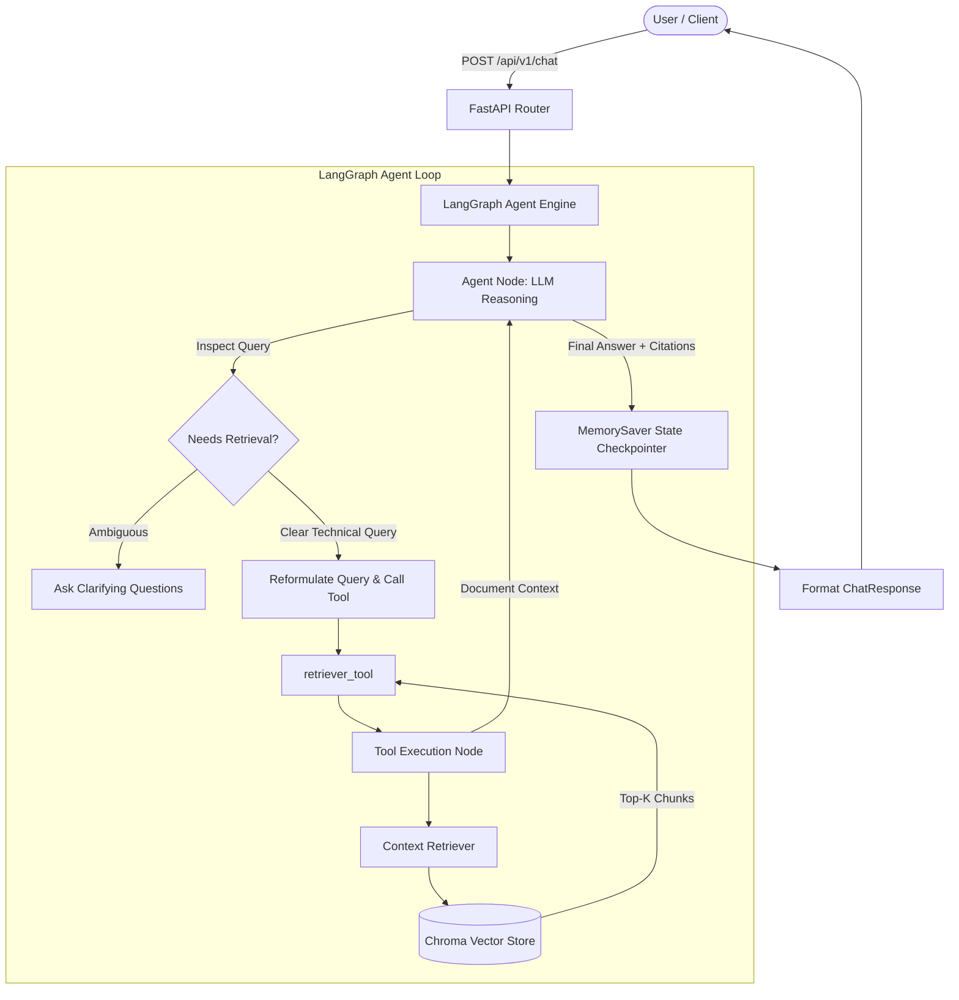

# 🤖 Technical Documentation Assistant (RAG Agent)

[](https://fastapi.tiangolo.com)
[](https://github.com/langchain-ai/langgraph)
[](https://github.com/langchain-ai/langchain)
[](https://www.trychroma.com/)
[-blue.svg?style=flat-square)](https://github.com/qdrant/fastembed)
[](https://www.python.org/)
[](LICENSE)

An intelligent, production-ready **Retrieval-Augmented Generation (RAG)** assistant built with **FastAPI**, **LangGraph**, **LangChain**, and **ChromaDB**. The assistant is specialized in indexing, searching, and reasoning over technical documentation to provide developers with accurate, source-grounded answers and production-ready code examples with zero hallucinations.

---

## 📑 Table of Contents

- [Key Features](#-key-features)
- [Architecture & Workflow](#-architecture--workflow)
- [Project Structure](#-project-structure)
- [Tech Stack](#-tech-stack)
- [Getting Started](#-getting-started)
  - [Prerequisites](#prerequisites)
  - [Installation](#installation)
  - [Environment Configuration](#environment-configuration)
- [Running the Application](#-running-the-application)
  - [Starting the FastAPI Server](#starting-the-fastapi-server)
  - [Running the CLI Test Harness](#running-the-cli-test-harness)
- [API Reference](#-api-reference)
  - [Health Check](#1-health-check)
  - [Chat with Assistant](#2-chat-with-assistant)
- [Adding Custom Documentation](#-adding-custom-documentation)
- [Contributing](#-contributing)
- [License](#-license)

---

## ✨ Key Features

- **Autonomous Agentic RAG (LangGraph)**: Uses a compiled `StateGraph` with conditional tool routing (`tools_condition`), cyclical reasoning loops, and multi-turn conversational memory (`MemorySaver`).
- **Intent Distillation & Query Reformulation**: Analyzes incoming natural language queries and distills them into high-precision technical search terms before invoking vector retrieval.
- **Strict Grounded Reasoning & Anti-Hallucination**: System prompts mandate that answers are strictly based on retrieved documentation chunks. If context is missing, the agent explicitly clarifies or states its limitations.
- **Document Source Citations**: Automatically tracks and references origin files (e.g., `fastapi_handling_errors.md`) in responses.
- **Fast Local Embeddings**: Utilizes `FastEmbed` (`BAAI/bge-small-en-v1.5`) for lightweight, high-performance CPU/GPU vector embeddings without incurring third-party embedding API costs.
- **Persistent ChromaDB Store**: Automated document ingestion, chunking via `RecursiveCharacterTextSplitter`, and persistent vector indexing.
- **Asynchronous REST API**: Powered by FastAPI with Pydantic validation, CORS middleware, and automatic Swagger/ReDoc OpenAPI documentation.

---

## 🏛️ Architecture & Workflow



---

## 📁 Project Structure

```text
rag-technical-docs-assistant/
├── app/
│   ├── __init__.py                 # Application package init
│   ├── main.py                     # FastAPI entrypoint, middleware & routers
│   ├── api/
│   │   ├── __init__.py             # API routers package
│   │   └── v1/
│   │       ├── __init__.py         # API v1 package
│   │       └── chat.py             # Chat endpoint handler (POST /api/v1/chat)
│   ├── core/
│   │   ├── __init__.py             # Core package
│   │   └── config.py               # Pydantic Settings and environment config
│   ├── schemas/
│   │   ├── __init__.py             # Schemas package
│   │   └── chat.py                 # ChatRequest and ChatResponse models
│   └── services/
│       ├── __init__.py             # Services package
│       ├── doc_processor.py        # Markdown document loader and text chunker
│       ├── retriever.py            # ContextRetriever with FastEmbed & ChromaDB
│       ├── agent/
│       │   ├── __init__.py         # Agent package
│       │   ├── prompt.py           # System prompts and prompt templates
│       │   └── exec.py             # LangGraph workflow, state graph, and executor
│       └── tools/
│           ├── __init__.py         # Tools package
│           └── retriever_tool.py   # LangChain @tool for documentation retrieval
├── data/
│   ├── documents/                  # Raw markdown technical documentation files
│   │   ├── fastapi_handling_errors.md
│   │   ├── fastapi_settings.md
│   │   └── _style_guide.md
│   └── vector_db/                  # Persistent ChromaDB vector database files
├── tests/                          # Automated tests directory
├── .env.example                    # Example environment variables template
├── .gitignore                      # Git ignore patterns
└── README.md                       # Project documentation
```

---

## 🛠️ Tech Stack

- **Framework**: [FastAPI](https://fastapi.tiangolo.com/)
- **Agent Workflow**: [LangGraph](https://github.com/langchain-ai/langgraph)
- **LLM Orchestration**: [LangChain](https://github.com/langchain-ai/langchain) & [LangChain-OpenAI](https://github.com/langchain-ai/langchain-openai)
- **Vector Database**: [ChromaDB](https://www.trychroma.com/)
- **Embeddings**: [FastEmbed](https://github.com/qdrant/fastembed) (`BAAI/bge-small-en-v1.5`)
- **Data Validation & Settings**: [Pydantic](https://docs.pydantic.dev/) & [pydantic-settings](https://docs.pydantic.dev/latest/concepts/pydantic_settings/)
- **Server**: [Uvicorn](https://www.uvicorn.org/)

---

## 🚀 Getting Started

### Prerequisites

- **Python 3.10+** installed on your machine.
- An API key for an OpenAI-compatible provider (such as [OpenRouter](https://openrouter.ai/) or [OpenAI](https://platform.openai.com/)).

### Installation

1. **Clone the repository:**
   ```bash
   git clone https://github.com/11linear11/rag-technical-docs-assistant.git
   cd rag-technical-docs-assistant
   ```

2. **Create and activate a virtual environment:**
   ```bash
   # On Linux/macOS
   python3 -m venv .venv
   source .venv/bin/activate

   # On Windows
   python -m venv .venv
   .venv\Scripts\activate
   ```

3. **Install dependencies:**
   ```bash
   pip install -r requirements.txt
   ```
   *(Or install the core packages: `fastapi uvicorn langgraph langchain langchain-openai langchain-chroma chromadb fastembed pydantic-settings`)*

### Environment Configuration

Copy the sample environment file `.env.example` to `.env`:

```bash
cp .env.example .env
```

Edit `.env` and fill in your settings:

```env
# Application Settings
APP_NAME="Technical Documentation Assistant"
APP_VERSION="1.0.0"
APP_ENVIRONMENT="development"

# LLM Configuration (OpenRouter, OpenAI, or any OpenAI-compatible provider)
API_KEY="your_api_key_here"
LLM_BASE_URL="https://openrouter.ai/api/v1"
LLM_MODEL="gpt-4o-mini"
LLM_TEMPERATURE=0.0
LLM_MAX_TOKENS=2048
LLM_MAX_ITERATIONS=3

# RAG & Storage Configuration
CHUNK_SIZE=1000
CHUNK_OVERLAP=200
DOCS_DIR="./data/documents"
CHROMA_PERSIST_DIR="./data/vector_db"
```

| Variable | Type | Default | Description |
| :--- | :--- | :--- | :--- |
| `APP_NAME` | `str` | `Technical Documentation Assistant` | Name of the application |
| `APP_VERSION` | `str` | `1.0.0` | Application release version |
| `APP_ENVIRONMENT` | `str` | `development` | Deployment environment (`development`, `production`) |
| `API_KEY` | `str` | *(Required)* | API key for LLM provider |
| `LLM_BASE_URL` | `str` | `https://openrouter.ai/api/v1` | Base URL for LLM API |
| `LLM_MODEL` | `str` | `gpt-4o-mini` | LLM model identifier |
| `LLM_TEMPERATURE` | `float` | `0.0` | Sampling temperature for LLM completions |
| `LLM_MAX_TOKENS` | `int` | `2048` | Max tokens generated per completion |
| `LLM_MAX_ITERATIONS` | `int` | `3` | Maximum agent reasoning loop iterations |
| `CHUNK_SIZE` | `int` | `1000` | Character size for document chunking |
| `CHUNK_OVERLAP` | `int` | `200` | Overlap character count between chunks |
| `DOCS_DIR` | `str` | `./data/documents` | Path to directory containing source Markdown docs |
| `CHROMA_PERSIST_DIR` | `str` | `./data/vector_db` | Path where Chroma database is persisted |

---

## 💻 Running the Application

### Starting the FastAPI Server

Start the application with Uvicorn:

```bash
uvicorn app.main:app --host 0.0.0.0 --port 8000 --reload
```

- **Interactive Swagger Documentation**: [http://localhost:8000/docs](http://localhost:8000/docs)
- **ReDoc Documentation**: [http://localhost:8000/redoc](http://localhost:8000/redoc)

### Running the CLI Test Harness

You can test the agent directly from your terminal:

```bash
python -m app.services.agent.exec
```

---

## 📡 API Reference

### 1. Health Check

Checks if the service is running and ready.

- **URL**: `/api/v1/health`
- **Method**: `GET`
- **Response**: `200 OK`

```json
{
  "status": "healthy"
}
```

---

### 2. Chat with Assistant

Sends a query to the agent. Supports stateful conversations using `thread_id`.

- **URL**: `/api/v1/chat`
- **Method**: `POST`
- **Headers**: `Content-Type: application/json`

#### Request Body

```json
{
  "query": "How can I implement custom exception handlers in FastAPI?",
  "thread_id": "optional-session-uuid-or-id"
}
```

> **Note**: If `thread_id` is omitted, the system generates a new UUID and preserves the conversation context for subsequent requests using that returned `thread_id`.

#### cURL Example

```bash
curl -X POST "http://localhost:8000/api/v1/chat" \
  -H "Content-Type: application/json" \
  -d '{
    "query": "How do I handle custom exceptions in FastAPI?",
    "thread_id": "session-123"
  }'
```

#### Successful Response (`200 OK`)

```json
{
  "response": "To handle custom exceptions in FastAPI, you can define a custom exception class and register an `@app.exception_handler`...\n\n**Source:** `fastapi_handling_errors.md`",
  "thread_id": "session-123"
}
```

---

## 📚 Adding Custom Documentation

1. Place any Markdown (`.md`) files into the `data/documents/` directory.
2. If the vector database (`data/vector_db/`) already exists and you want to trigger a complete re-index, simply remove the existing database folder:
   ```bash
   rm -rf ./data/vector_db
   ```
3. Restart the service or run the agent. The `ContextRetriever` will automatically detect the missing store, load all `.md` files, chunk them, compute embeddings using FastEmbed, and persist the new vector database.

---

## 🤝 Contributing

Contributions are welcome! To contribute:

1. Fork the repository.
2. Create your feature branch (`git checkout -b feature/amazing-feature`).
3. Commit your changes (`git commit -m 'Add amazing feature'`).
4. Push to the branch (`git push origin feature/amazing-feature`).
5. Open a Pull Request.

---

## 📄 License

This project is open-source and licensed under the [MIT License](LICENSE).